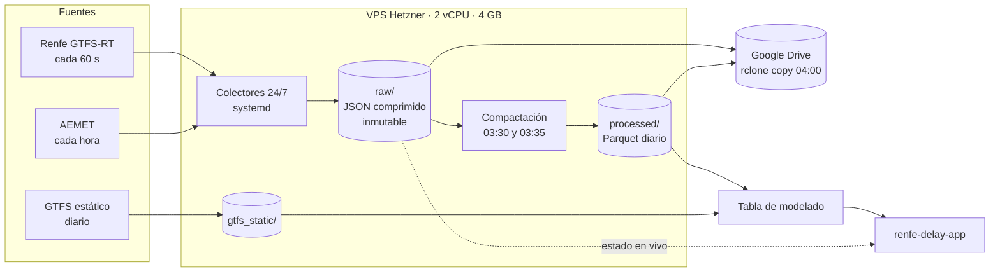

# Cercanías Madrid · Pipeline de captura de datos

**Aplicación que usa estos datos:** [cercanias-madrid.es](https://cercanias-madrid.es) ·
[repositorio de la aplicación](https://github.com/I-Bovingdon/renfe-delay-app)

Trabajo Fin de Máster del Máster en Data Science, Big Data & Business Analytics (UCM, 2026).
Este repositorio contiene la ingesta 24/7 que construye desde cero el histórico de retrasos
de Cercanías de Madrid, que Renfe no publica, y los datos meteorológicos que lo acompañan.

> **In English.** A 24/7 ingestion pipeline on a 5 € VPS that captures Renfe's
> GTFS-Realtime feeds every 60 seconds and AEMET weather every hour, stores the raw
> JSON immutably, compacts it nightly to Parquet and backs it up to Google Drive.
> Running since 13 June 2026, it is the only source of training data for the delay
> model served by
> [renfe-delay-app](https://github.com/I-Bovingdon/renfe-delay-app).

---

## El problema de partida

**Renfe no archiva ni publica histórico de retrasos de Cercanías.** Solo expone tres feeds
GTFS-Realtime que se sobrescriben cada 20 a 30 segundos. Lo que no se captura en el momento
se pierde para siempre, así que la ingesta fue la primera pieza del proyecto y la de mayor
prioridad.

## Qué captura

| Fuente | Frecuencia | Contenido | Uso |
|---|---|---|---|
| `trip_updates` (Renfe) | 60 s | Retraso por tren en su próxima parada | Variable objetivo |
| `vehicle_positions` (Renfe) | 60 s | Posición y estado de cada tren | Estado de la red y mapa |
| `alerts` (Renfe) | 60 s | Incidencias en texto libre | Variables de incidencias y pantalla de alertas |
| AEMET OpenData | 1 h | Observación horaria de 15 estaciones del corredor | Variables meteorológicas |
| GTFS estático (Renfe) | Diaria | Horario teórico, líneas y paradas | Línea de cada tren, filtro de Madrid, catálogo de la app |

Además se descargó la climatología diaria de AEMET de 2020 a 2025.

**Volumen a 15/09/2026:** 94 días compactados (del 13/06 al 14/09), con 3,1 GB en bruto
comprimido y 468 MB en Parquet de Renfe, y 1,2 GB de AEMET con el histórico incluido.
El disco del servidor está al 46 % de 38 GB.

---

## Arquitectura



### Cadena nocturna

Hora del servidor (UTC). El orden importa: cada tarea usa lo que deja la anterior.

| Hora | Tarea | Usuario |
|---|---|---|
| 03:30 | Compactación de Renfe del día anterior (`compact_day.py`) | tfm |
| 03:35 | Compactación de AEMET del día anterior (`compact_aemet.py`) | tfm |
| 03:45 | Descarga del GTFS estático (`download_gtfs_static.py`) | tfm |
| 03:55 | Regeneración del catálogo de la aplicación (en [renfe-delay-app](https://github.com/I-Bovingdon/renfe-delay-app)) | tfm |
| 04:00 | Copia de `data-renfe` y `data-aemet` a Google Drive | root |

---

## Decisiones de diseño

- **Un VPS de unos 5 € al mes y no Databricks ni un servicio gestionado.** El colector pasa
  casi todo el tiempo esperando la respuesta del feed y consume menos de una CPU; pagar un
  clúster por esperar no tiene sentido. Se eligió Hetzner porque Oracle Cloud y Google
  Cloud exigían tarjeta de crédito, y se descartó GitHub Actions con cron porque su
  planificación no está garantizada.
- **Captura cada 60 segundos.** El feed solo da el estado de la próxima parada, así que la
  evolución del retraso se reconstruye captura a captura. Con menos frecuencia se pierde
  resolución; con más, crece el volumen sin información nueva.
- **Capas separadas: bruto inmutable, Parquet y copia.** El JSON se guarda tal cual llega,
  deduplicado por la marca de tiempo del feed y con escritura atómica. Un error de
  transformación se corrige reprocesando; un dato no capturado no se recupera.
- **systemd con reinicio automático.** Un colector que se cae en silencio equivale a no
  tenerlo. Verificado con un reinicio de control del servidor.
- **`rclone copy` y no `sync`.** La copia solo añade: un borrado en el servidor nunca se
  propaga a Drive.
- **AEMET sí, Twitter/X no.** La API de X cuesta dinero por lectura y su contenido repite
  el feed oficial de incidencias.
- **La clave de AEMET nunca entra en Git.** Vive en el `.env` del servidor;
  el repositorio solo incluye `.env.example`.

---

## Estructura

```
renfe-collector/
  scripts/collector.py              Captura 24/7 de los tres feeds (systemd)
  scripts/compact_day.py            Compactación diaria a Parquet
  scripts/download_gtfs_static.py   Descarga diaria del GTFS estático
  scripts/build_gtfs_reference.py   Tablas de referencia de Madrid: línea por tren y estaciones
  scripts/inspect_day.py            Diagnóstico de un día de capturas
  deploy/renfe-collector.service    Servicio systemd, con las rutas del servidor
  explora.ipynb                     Cuaderno de la auditoría inicial de los feeds
aemet-collector/
  scripts/collector_live.py         Observación horaria en vivo (systemd)
  scripts/backfill_historico.py     Climatología histórica 2020 a 2025
  scripts/compact_aemet.py          Compactación a Parquet con deduplicación
  scripts/aemet_common.py           Cliente de la API de AEMET
  scripts/estaciones_madrid.py      Estaciones del corredor de Cercanías
  deploy/aemet-collector.service    Servicio systemd, con las rutas del servidor
  .env.example                      Plantilla de la clave (la real nunca se versiona)
docs/
  Estructura_Datos_TFM_Cercanias.pdf  Esquema de los datos capturados
```

En el servidor, el repositorio está en `/home/tfm/tfm-cercanias-colectores` y los datos
viven fuera de él, en `/home/tfm/data-renfe` y `/home/tfm/data-aemet`, con carpetas `raw/`
y `processed/`. Cada colector tiene su propio README con la instalación paso a paso.

## Despliegue y actualización

```bash
# En el servidor, como usuario tfm
git -C /home/tfm/tfm-cercanias-colectores pull --ff-only
sudo systemctl restart renfe-collector aemet-collector   # solo si cambian los colectores
```

Los crons de compactación usan el entorno virtual de `renfe-collector/.venv` (pandas y
pyarrow); los colectores, el Python del sistema.

---

## Lo que el feed no publica, y cómo se resolvió

Auditoría inicial sobre datos reales del 13 y 14 de junio, ampliada después.

| Campo ausente | Consecuencia | Solución |
|---|---|---|
| `route_id` (nulo en el 100 %) | No se sabe la línea de cada tren | Cruce con el GTFS estático por el núcleo del `trip_id`, tras quitar el prefijo que Renfe publica distinto en tiempo real y en estático. Coincidencia del 99,9 % |
| Serie temporal del retraso | Solo llega la próxima parada | Reconstrucción cruzando capturas consecutivas del mismo tren |
| `bearing` y `speed` (nulos) | No hay rumbo ni velocidad | El rumbo del mapa se deriva del tramo de vía entre estaciones |
| `cause` y `effect` en incidencias (nulos) | El tipo de incidencia no viene estructurado | Clasificación por expresiones regulares sobre el texto |
| `departure_delay_s` (99 % nulo) | Solo hay retraso de llegada | El objetivo se define sobre `arrival_delay_s` |

Otros hallazgos del primer día: el retraso tiene mediana 0 s, percentil 90 de unos 6 min y
percentil 99 de unos 28 min. El feed es nacional (Madrid, Barcelona, Valencia, Sevilla…),
así que el filtro de Madrid se hace por la estructura del `route_id` y no por coordenadas.
El 13/06 apareció un 6,5 % de retrasos cercanos a ±24 h que no se repitió;
`compact_day.py` avisa en el registro de cualquier retraso superior a 2 h.

## Incidencias de operación

- **Compactación de AEMET parada 27 días sin avisar.** El cron usaba la fecha del día en
  curso y un `%` sin escapar. Corregido y rellenado al 100 %.
- **Proceso eliminado por falta de memoria.** Resuelto con 2 GB de swap permanente y
  límites de memoria en los servicios.
- **Feeds vacíos en horario de servicio.** El colector avisa en el registro cuando un feed
  llega sin contenido, para distinguir un fallo del emisor de uno propio.

---

## Del dato al modelo

Los Parquet diarios y las tablas de referencia del GTFS alimentan la tabla de modelado, de
11.431.362 filas y 28 variables, con la que se entrenó el modelo LightGBM en producción.
El modelo, su validación y sus limitaciones están documentados en el
[README de la aplicación](https://github.com/I-Bovingdon/renfe-delay-app#modelo).

<!-- MODELADO: cuando se incorpore el código que construye la tabla (carpeta modelado/),
     añadirla al bloque de Estructura y enlazarla aquí. -->

## Limitaciones

- **Histórico de verano.** La captura empieza en junio, así que el efecto de la lluvia está
  poco representado. La climatología 2020 a 2025 no incluye retrasos.
- **Un solo servidor.** No hay redundancia de captura: una caída del VPS es tiempo perdido.
  La copia diaria protege lo capturado, no lo que se deja de capturar.

## Equipo

Ainhoa, Carlos, Jimena, Patricia, Rubén e Ismael.

- **Infraestructura, pipeline de captura y este repositorio:** Ismael Bovingdon.

Tutores: Carlos Ortega y Santiago Mota.

## Licencia y fuentes

Código bajo licencia MIT. Datos de Renfe (CC BY 4.0) y AEMET OpenData, sujetos a sus
propias condiciones de uso.
